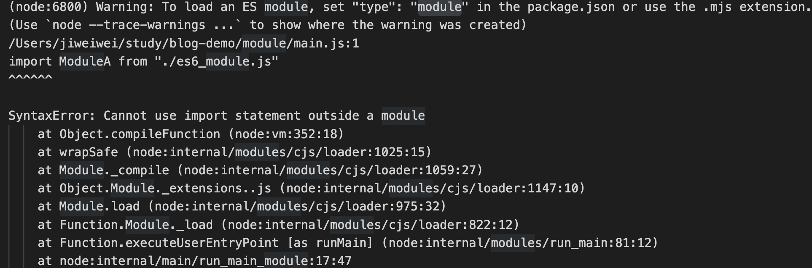

# js 模块化

## 什么是模块化

模块化就是将 代码 分割成若干个单独文件，这些单独的文件内部变量是私有的，只会向外暴露出部分变量与其他单元通信。
每个这些单元就叫模块，这个过程就叫模块化过程。

## 模块化的作用是什么

- 解决代码 全局变量 命名冲突  
  实际的开发过程中，经常会遇到变量、函数、对象等名字的冲突，这样就容易造成冲突，还会造成全局变量被污染。
- 解决，工程比较大时，文件引入太多造成的依赖混乱
- 让我们更容易的维护代码

## 如何将代码模块化

可以遵循以下几种规范之一，将 js 代码 模块化。他们分别是 CJS(CommonJs), AMD, CMD(基本不用), ESM(ES6 Module)

## CJS(CommonJs) 规范

### 概念

CommonJS 规范是一种同步加载模块的方式，每个模块内部，module 变量代表当前模块。这个变量是一个对象，它的 exports 属性（即 module.exports）是对外的接口。加载某个模块用 require，其实就是加载该模块的 module.exports 属性。该规范规定一个模块，有自己的作用域；在一个模块中定义的变量、函数等都是私有变量，对其他文件不可见。导出也可以简写为 exports 直接导出。

### 用法

几个模块文件：

```js
/* modulea */
const num = 123;
module.exports = num;
```

```js
/* moduleb */
const num1 = 1;

module.exports = {
  num1,
};
```

```js
/* modulec */
// module.exports 也可以导出多个属性
const num = 456;

module.exports.num = num;
module.exports.name = "modulec";

// 也可以这么书写 和上面等同
exports.num = num;
exports.name = "modulec";
```

然后在 main.js 里引入这几个模块

```js
// 用 require 导入模块
/* 
require除了能够作为函数调用加载模块以外，它本身作为一个对象还有以下属性：
resolve：需要解析的模块路径。
main：Module对象，表示当进程启动时加载的入口脚本。
extensions：如何处理文件扩展名。
cache：被引入的模块将被缓存在这个对象中。
*/
const modulea = require("./modulea");
const moduleb = require("./moduleb");
const modulec = require("./modulec");

console.log(modulea); // 123
console.log(moduleb); // { num1: 1 }
console.log(modulec); // { num: 456, name: 'modulec' }
```

#### CommonJs Module 对象

1. 打印看下 模块的 module 对象的属性

```js
// Module modulea
Module {
  id: '.',
  path: '/Users/jiweiwei/study/blog-demo/node-demo/commonjs',
  exports: {},
  filename: '/Users/jiweiwei/study/blog-demo/node-demo/commonjs/modulea.js',
  loaded: false,
  children: [],
  paths: [
    '/Users/jiweiwei/study/blog-demo/node-demo/commonjs/node_modules',
    '/Users/jiweiwei/study/blog-demo/node-demo/node_modules',
    '/Users/jiweiwei/study/blog-demo/node_modules',
    '/Users/jiweiwei/study/node_modules',
    '/Users/jiweiwei/node_modules',
    '/Users/node_modules',
    '/node_modules'
  ]
}
```

```js
// Module main
Module {
  id: '.',
  path: '/Users/jiweiwei/study/blog-demo/node-demo/commonjs',
  exports: {},
  filename: '/Users/jiweiwei/study/blog-demo/node-demo/commonjs/main.js',
  loaded: false,
  children: [
    Module {
      id: '/Users/jiweiwei/study/blog-demo/node-demo/commonjs/modulea.js',
      path: '/Users/jiweiwei/study/blog-demo/node-demo/commonjs',
      exports: 123,
      filename: '/Users/jiweiwei/study/blog-demo/node-demo/commonjs/modulea.js',
      loaded: true,
      children: [],
      paths: [Array]
    },
    Module {
      id: '/Users/jiweiwei/study/blog-demo/node-demo/commonjs/moduleb.js',
      path: '/Users/jiweiwei/study/blog-demo/node-demo/commonjs',
      exports: [Object],
      filename: '/Users/jiweiwei/study/blog-demo/node-demo/commonjs/moduleb.js',
      loaded: true,
      children: [],
      paths: [Array]
    },
    Module {
      id: '/Users/jiweiwei/study/blog-demo/node-demo/commonjs/modulec.js',
      path: '/Users/jiweiwei/study/blog-demo/node-demo/commonjs',
      exports: [Object],
      filename: '/Users/jiweiwei/study/blog-demo/node-demo/commonjs/modulec.js',
      loaded: true,
      children: [],
      paths: [Array]
    }
  ],
  paths: [
    '/Users/jiweiwei/study/blog-demo/node-demo/commonjs/node_modules',
    '/Users/jiweiwei/study/blog-demo/node-demo/node_modules',
    '/Users/jiweiwei/study/blog-demo/node_modules',
    '/Users/jiweiwei/study/node_modules',
    '/Users/jiweiwei/node_modules',
    '/Users/node_modules',
    '/node_modules'
  ]
}
```

2. 属性含义

- id：模块的识别符，通常是带有绝对路径的模块文件名
- filename：模块的文件名，带上绝对路径。
- loaded：返回一个布尔值，表示模块是否已路径经完成加载。
- children：一个数组，表示该模块要用到的其他模块。
- exports：模块对外输出的对象。
- path：模块的目录名称。
- paths：模块的搜索路径。

#### 模块缓存

如果在入口文件里，多次加载同一个模块，其实这个模块只会执行一次，其余的引入都是读取的缓存。为了验证这一结论，修改一下 main.js 和模块 c 的代码。

```js
const num = 456;
console.log("执行 模块 c");
exports.num = num;
exports.name = "modulec";
```

```js
const modulea = require("./modulea");
const moduleb = require("./moduleb");
const modulec = require("./modulec");
const modulec1 = require("./modulec");
const modulec2 = require("./modulec");

console.log(module);

console.log(modulea); // 123
console.log(moduleb); // { num1: 1 }
console.log(modulec); // { num: 456, name: 'modulec' }

modulec.num++;

console.log(modulec1); // { num: 457, name: 'modulec' }

modulec1.num++;

console.log(modulec2); // { num: 458, name: 'modulec' }
```

可以看到 模块 c 只执行了一次，并且 修改了导入模块的 num 属性时，再次导入也是会变化的，这便验证了，上面所述其实是读取的缓存。
如果不想读 缓存可以手动清除一下。

清除方式为 delete require.cache[modulePath]将缓存的模块删除 modulePath 模块绝对路径

```js
const modulea = require("./modulea");
const moduleb = require("./moduleb");
const modulec = require("./modulec");
delete require.cache[
  "/Users/jiweiwei/study/blog-demo/node-demo/commonjs/modulec.js"
];
const modulec1 = require("./modulec");
const modulec2 = require("./modulec");

console.log(module);
console.log(require);

console.log(modulea); // 123
console.log(moduleb); // { num1: 1 }
console.log(modulec); // { num: 456, name: 'modulec' }

modulec.num++;

console.log(modulec1); // { num: 456, name: 'modulec' }

modulec1.num++;

console.log(modulec2); // { num: 457, name: 'modulec' }
```

这里就可以看到， 模块 c 是打印了两次的，并且清除了一次缓存后 num 属性也少累加了一次。

### 总结 cjs 规范的特点如下

- commonJS 用同步的方式加载模块
- 所有代码都运行在模块作用域，不会污染全局作用域。
- 模块可以多次加载，但是只会在第一次加载时运行一次，然后运行结果就被缓存了，以后再加载，就直接读取缓存结果。要想让模块再次运行，必须清除缓存。
- 加载模块后主动修改对应导出的属性时，如果不清除缓存的话，可以当着是一个浅拷贝，后面再加载的模块都是修改后的。
- 模块加载的顺序，按照其在代码中出现的顺序。

## AMD 规范

异步模块定义 Asynchronous Module Definition

### 概念

commonJS 是同步方式加载模块，因为这个是在服务端，读取模块文件很快。而在浏览器端，异步加载模块的方案会更适合。AMD 规范就是采用异步方式加载模块，模块的加载不会影响后面语句的运行。所有依赖这些模块的，都会定义在回调函数中，等都加载完成之后，这个回调函数才会执行。

### requirejs 简介

requirejs 是实现 AMD 规范的一个库。require.config() 方法配置模块路径；define() 方法定义模块。 require()加载模块

### requirejs 用法

#### 引入

在 html 文件中 用 script 标签引入，[require.js](https://requirejs.org/docs/download.html#requirejs) 并配置入口文件。

```html
<script src="./lib/require.js" data-main="./lib/main.js"></script>
```

注意这里的 data-main 不可省略，这个 main.js 就是入口文件。

#### 创建入口文件

用 require.config() 方法来定义模块，baseUrl 属性为配置模块的公共路径前缀， path 属性则是实际的模块路径。比如 jquery-1.7.2.min 这里省略了 .js 后缀。
实际拼接的路径为 ./lib/jquery-1.7.2.min.js

```js
require.config({
  baseUrl: "./lib",
  paths: {
    jquery: "jquery-1.7.2.min",
    utils: "utils",
    videoSwiper: "videoSwiper",
    videoPlayer: "indexPlayer",
    mySwiper: "mySwiper",
    pageControllers: "indexPage",
  },
});
```

用 require() 方法来导入模块，第一参数是一个数组，用来定义要导入的模块，没有先后关系。 第二个参数是一个函数，所有的模块加载完毕后，会走
这个回调函数。需要注意的是，回调函数的形参顺序，需要和第一个参数的数组顺序一致。

```js
require(["utils", "videoSwiper", "pageControllers", "jquery"], function (
  utils,
  VideoSwiper,
  PageControllers,
  $
) {
  // 回调函数内，编写业务逻辑
});
```

#### 用 define() 方法，可以定义一个模块

define 函数第一个参数 是字符串表示模块的名称， 第二参数是一个数组，表示这个模块需要依赖的模块，第三个参数是一个函数

- 方法一： 定义一个命名模块， 我们熟悉的 jquery 就是这么定义的

```js
define("utils", [], function () {
  return {
    toSting: function(),
    toNumber: function()
  };
});
```

jquery v3.6.0 Line 10841

```js
if (typeof define === "function" && define.amd) {
  define("jquery", [], function () {
    return jQuery;
  });
}
```

- 方法二 定义一个不依赖于其他模块的模块

```js
define(function () {
  return {
    name: "jquery",
  };
});
```

- 方法三 有依赖的定义方式

```js
// AMD 在执行以下代码的时候，RequireJS 会首先分析依赖数组，然后依次加载，直到所有加载完毕再执行回到函数
define(["moduleA", "moduleB"], function (moduleA, moduleB) {
  return {
    moduleC: "***",
  };
});
```

### requirejs 规范特点

- 异步加载模块，模块之间没有先后关系。
- 加载模块，不会阻止页面的渲染。

## CMD 模块化 规范

通用模块定义 Common Module Definition。CMD 和 AMD 比较类似。此规范其实是在 sea.js 推广过程中产生的， 用的相对较少。

### CMD 和 AMD 共同点

- 都是异步加载模块
- 都是用于浏览器端

### CMD 和 AMD 区别

- AMD 是依赖前置，即可以知道模块都依赖于哪些模块。 CMD 是就近导入。
- AMD 规范 的实现 是 require.js CMD 规范 实现的是 sea.js

### sea.js 用法

#### 引入

```html
<script type="text/javascript" src="js/libs/sea.js"></script>
```

#### 加载入口文件

```js
seajs.use("./js/modules/main.js");
```

#### define() 定义一个模块

- 定义没有依赖的模块

```js
//定义没有依赖的模块
define(function (require, exports, module) {
  exports.xxx = value;
  module.exports = value;
});
```

- 定义有依赖的模块

```js
// 定义有依赖的模块
// CMD 在执行以下代码的时候， SeaJS 会首先用正则匹配出代码里面所有的 require 语句，拿到依赖，然后依次加载，加载完成再执行回调函数
define(function (require, exports, module) {
  //引入依赖模块(同步)
  var module2 = require("./module2");
  //引入依赖模块(异步)
  require.async("./module3", function (m3) {});
  //暴露模块
  exports.xxx = {};
});
```

## ES6 模块化 规范 ⭐️

ES6 标准模块化规范，该模块功能主要由两个命令构成，分别是 export 和 import。export 命令用于规定模块的对外接口，import 命令用于输入其他模块提供的功能。最推荐的模块化方案。不过目前部分浏览器尚未执行该模块标准，所以仍需借助 babel 转译。

### 用法 - export 导出模块

- 指定导出, 这种导出方式，在导入时需要使用解构

```js
const A = "a";

export const ModuleA = A;
```

- 默认导出，这种导出方式，在导入时可直接使用

```js
export default {
  b: "b",
};
```

### 用法 - import 导入模块

- 同步导入

```js
import { ModuleA } from "./es6_module.js";
import ModuleB from "./es6_module2.js";

console.log(ModuleA);
console.log(ModuleB);
```

注意： 上述导入的方式，在 node 环境中是不行的，会报语法错误。如下图

根据上图所示，只需在 package.json 文件中，新增 type 属性为 module 即可。

```js
{
  "name": "module",
  "version": "1.0.0",
  "description": "",
  "main": "main.js",
  "type": "module",
  "scripts": {
    "test": "echo \"Error: no test specified\" && exit 1"
  },
  "keywords": [],
  "author": "",
  "license": "ISC"
}

```

- 异步导入 import()加载模块成功以后，这个模块会作为一个对象，当作then方法的参数。因此，可以使用对象解构赋值的语法，获取输出接口。 

```js
import("./es6_module.js").then(({ default: theDefault }) => {
  console.log(theDefault);
});
```

es6 module 语法，参见阮一峰的 es6 [module 文档](https://es6.ruanyifeng.com/#docs/module)

### ES6 Module 和 CommonJs 区别


## UMD 规范

## 参考链接

[ECMAScript 6 入门](https://es6.ruanyifeng.com/#docs/module)  
[CommonJS 规范 阮一峰](https://javascript.ruanyifeng.com/nodejs/module.html)
