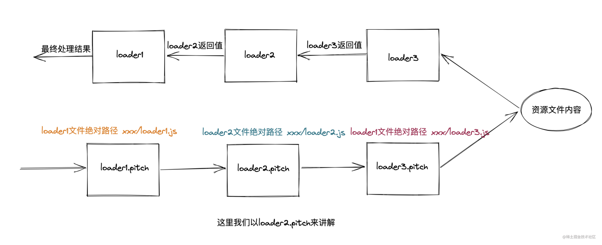
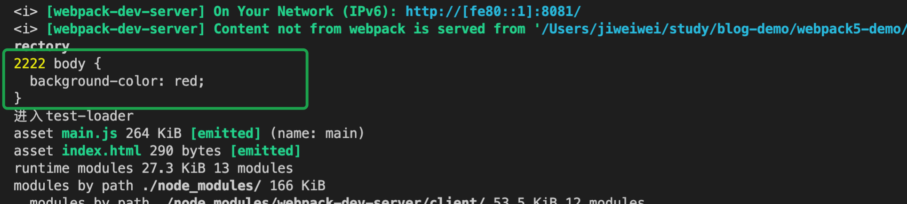
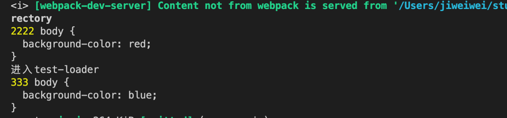
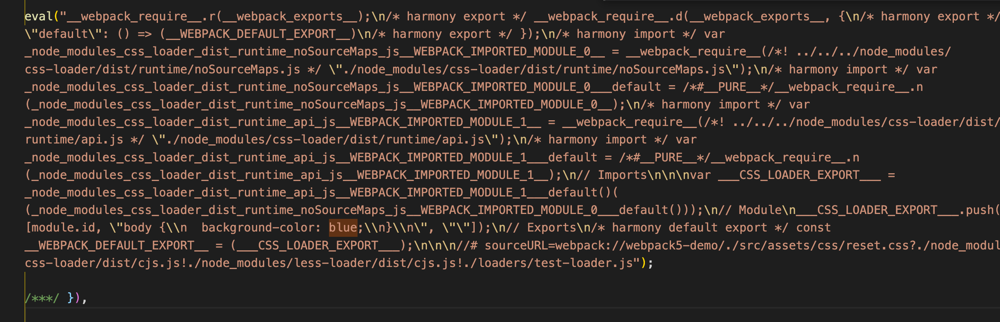

# webpack

## 概念

webpack 是一个用于现代 JavaScript 应用程序的 静态模块打包工具。当 webpack 处理应用程序时，它会在内部从一个或多个入口点构建一个 依赖图[dependency graph](/front/webpack/#依赖图)，然后将你项目中所需的每一个模块组合成一个或多个 bundles，它们均为静态资源，用于展示你的内容。
webpack 打包非常复杂，但大致可以简化为： 输入 => 模块处理 => 后处理 => 输出    
- 输入： 根据入口读代码文件
- 模块处理： 利用各种 loader 递归转译非 js 模块
- 后处理 所有模块处理完毕后，进行模块的合并，优化，输出 chunk 集合
- 输出 将 chunk 写入到输出目录

### 入口

**入口(entry)**
入口起点(entry point) 指示 webpack 应该使用哪个模块，来作为构建其内部 依赖图(dependency graph) 的开始。进入入口起点后，webpack 会找出有哪些模块和库是入口起点（直接和间接）依赖的。

默认值是 ./src/index.js，但你可以通过在 webpack configuration 中配置 entry 属性，来指定一个（或多个）不同的入口起点

**webpack.config.js**

```js
module.exports = {
  entry: "./src/main.js",
};
```

### 输出

**输出(output)**
output 属性告诉 webpack 在哪里输出它所创建的 bundle，以及如何命名这些文件。主要输出文件的默认值是 ./dist/main.js，其他生成文件默认放置在 ./dist 文件夹中。

你可以通过在配置中指定一个 output 字段，来配置这些处理过程：

```js
module.exports = {
  entry: "./src/main.js",
  output: {
    path: path.resolve(__dirname, "dist"),
    filename: "main.js",
  },
};
```

在上面的示例中，我们通过 output.filename 和 output.path 属性，来告诉 webpack bundle 的名称，以及我们想要 bundle 生成(emit)到哪里。

### loader

webpack 只能理解 JavaScript 和 JSON 文件，这是 webpack 开箱可用的自带能力。loader 让 webpack 能够去处理其他类型的文件(比如 css 和 图片)，并将它们转换为有效 模块，以供应用程序使用，以及被添加到依赖图中。比如可以通过 import 来导入 css，这是 **webpack 自带的强大特性**。

loader 有两个属性 test 和 use。 loader 需要在 webpack 的 module 配置项中配置，下面的示例 是让我们能够处理 css 文件：

```js
  // css-loader 会对 @import 和 url() 进行处理，就像 js 解析 import/require() 一样。
  // style-loader 把 CSS 插入到 DOM 中。。
    module: {
    rules: [
      {
        test: /\.css$/,
        use: ['style-loader', 'css-loader']
      }
    ]
  },
```

### 插件

**插件(plugin)**  
loader 用于转换某些类型的模块，而插件则可以用于执行范围更广的任务。包括：打包优化，资源管理，注入环境变量  
想要使用一个插件，你只需要 require() 它，然后把它添加到 plugins 数组中。多数插件可以通过选项(option)自定义。你也可以在一个配置文件中因为不同目的而多次使用同一个插件，这时需要通过使用 new 操作符来创建一个插件实例。

```js
module.exports = {
  mode: "development",

  entry: "./src/main.js",

  output: {
    path: path.resolve(__dirname, "dist"),
    filename: "main.js",
  },

  module: {
    rules: [
      {
        test: /\.css$/,
        use: ["style-loader", "css-loader"],
      },
    ],
  },

  plugins: [new HtmlWebpackPlugin({ template: "./public/index.html" })],
};
```

### 模式

**模式(mode)**  
通过选择 development, production 或 none 之中的一个，来设置 mode 参数，你可以启用 webpack 内置在相应环境下的优化。其默认值为 production。

```js
module.exports = {
  mode: "production",
};
```

## 依赖图

每当一个文件依赖另一个文件时，webpack 都会将文件视为直接存在 依赖关系。这使得 webpack 可以获取非代码资源，如 images 或 web 字体等。并会把它们作为 依赖 提供给应用程序。

当 webpack 处理应用程序时，它会根据命令行参数中或配置文件中定义的模块列表开始处理。 从 入口 开始，webpack 会递归的构建一个 依赖关系图，这个依赖图包含着应用程序中所需的每个模块，然后将所有模块打包为少量的 bundle —— 通常只有一个 —— 可由浏览器加载。

## loader 详解

loader 用于对模块的源代码进行提起预处理转换，其本质上就是一个函数。

### 使用 loader

有两种使用 loader 的方式：

- 配置方式（推荐）：在 webpack.config.js 文件中指定 loader。
- 内联方式：在每个 import 语句中显式指定 loader。不常用 style-loader 用到 内联 loader

#### 配置方式

在 webpack module.rules 配置中指定多个 loader。 这种方式是展示 loader 的一种简明方式，并且有助于使代码变得简洁和易于维护。  
**注意 loader 从右到左（或从下到上）地取值(evaluate)/执行(execute)。**

```js
  module: {
    rules: [
      {
        test: /\.[c|le]ss$/,
        use: ['style-loader', 'css-loader', "less-loader"]
      },
    ]
  },
```

### loader 特性

- loader 支持链式调用。链中的每个 loader 会将转换应用在已处理过的资源上。一组链式的 loader 将按照相反的顺序执行。链中的第一个 loader 将其结果（也就是应用过转换后的资源）传递给下一个 loader，依此类推。最后，链中的最后一个 loader，返回 webpack 所期望的 JavaScript。
- loader 可以是同步的，也可以是异步的。
- loader 可以通过 options 对象配置
- 插件(plugin)可以为 loader 带来更多特性
- loader 能够产生额外的任意文件。

### 解析 loader 的路径

- loader 遵循标准 模块解析 规则。多数情况下，loader 将从 模块路径 加载（通常是从 npm install, node_modules 进行加载）
- 也可以将应用程序中的文件作为自定义 loader。按照约定，loader 通常被命名为 xxx-loader（例如 json-loader

### loader 加载顺序

除了上述使用到的 test 和 use 参数。use 为一个数组时表示有多个 loader 依次处理匹配的资源，按照 从右往左(从下往上) 的顺序去处理。如果不想按照数组倒叙的方式处理，可以给 loader 配置一个 enforce 参数。 enforce 有两个值分别为 pre、post， pre 叫 前置 loader， post 叫后置 loade 。 默认的就是普通 loader。
Pitching  阶段: loader 上的 pitch 方法，按照   后置(post)、行内(inline)、普通(normal)、前置(pre)  的顺序调用。
Normal  阶段: loader 上的 常规方法，按照   前置(pre)、普通(normal)、行内(inline)、后置(post)  的顺序调用。


### 自定义 loader

#### 引入自定义 loader 的两种 方式

- 第一种 用 reslove 路径形式 通过在 rule 对象使用 path.resolve 指定一个本地文件

```js
module.exports = {
  //...
  module: {
    rules: [
      {
        test: /\.js$/,
        use: [
          {
            loader: path.resolve("path/to/loader.js"),
            options: {
              /* ... */
            },
          },
        ],
      },
    ],
  },
};
```

- 第二种 匹配（test）多个 loaders，你可以使用 resolveLoader.modules 配置，webpack 将会从这些目录中搜索这些 loaders。例如，如果你的项目中有一个 /loaders 本地目录：

```js
module.exports = {
  //...
  resolveLoader: {
    modules: ["node_modules", path.resolve(__dirname, "loaders")],
  },
};
```

#### 编写 一个自定义 loader

loader 本质上是导出函数的 javaScript 模块。所导出的函数，可用于实现内容转换。  
下面是一个简单的 loader, source 参数就是源码内容，这里没做处理，直接返回了。

reset.css

```css
body {
  background-color: red;
}
```

```js
function testLoader(source) {
  console.log(2222, source);
  console.log("进入test-loader");
  return source;
}

module.exports = testLoader;
```

下面打印出来的 source 就是 reset.css 的文件内容


下面对 source 加工一下，将红色改为 蓝色 后返回

```js
function testLoader(source, map, meta) {
  /* 
  1. source 文件内容
  2. map sourceMap
  3. meta 别的 loader 传递的数据 
  */
  console.log(2222, source);
  console.log("进入test-loader");
  let _res = source.replace("red", "orange");
  console.log(333, _res);
  return _res;
}

module.exports = testLoader;
```


编译的样式 被成功改为 蓝色 了



### loader 分类

1. 同步 loader

- 写法一

```js
function testLoader(source, map, meta) {
  /* 
  1. source 文件内容
  2. map sourceMap
  3. meta 别的 loader 传递的数据 
  */
  console.log(2222, source);
  console.log("进入test-loader");
  let _res = source.replace("red", "orange");
  console.log(333, _res);
  return _res;
}

module.exports = testLoader;
```

- 写法二

```js
function testLoader(source, map, meta) {
  /* 
  1. source 文件内容
  2. map sourceMap
  3. meta 别的 loader 传递的数据 
  */
  console.log(2222, source);
  console.log("进入test-loader");
  let _res = source.replace("16px", "36px");
  console.log(333, _res);
  /* 
  参数1: 代表是否有错
  参数2: 处理后的内容
  参数3: sourceMap 继续传递给 sourceMap
  参数4: 给下一个loader 传递参数
  */
  this.callback(null, _res, map, meta);
}

module.exports = testLoader;
```

2. 异步 loader

```js
function testLoader(source, map, meta) {
  /* 
  1. source 文件内容
  2. map sourceMap
  3. meta 别的 loader 传递的数据 
  */
  console.log(2222, source);
  console.log("进入testcbAsync-loader");
  let _res = source.replace("#fff", "red");
  console.log(333, _res);
  /* 
  参数1: 代表是否有错
  参数2: 处理后的内容
  参数3: sourceMap 继续传递给 sourceMap
  参数4: 给下一个loader 传递参数
  */
  let callback = this.async();
  setTimeout(() => {
    callback(null, _res, map, meta);
  }, 1000);
}

module.exports = testLoader;
```

3. Raw loader 接受到的数据是 buffer 数据流。 当我们处理不必要的字体图标的时候
   只需要额外 添加 testLoader.raw = true

```js
function testLoader(source, map, meta) {
  /* 
  1. source 文件内容
  2. map sourceMap
  3. meta 别的 loader 传递的数据 
  */
  console.log(2222, source);
  console.log("进入test-loader");
  let _res = source.replace("red", "orange");
  console.log(333, _res);
  return _res;
}
testLoader.raw = true;
module.exports = testLoader;
```

4. Pitch loader
   在处理资源文件之前，首先会经历 pitch 阶段,pitch 结束后，读取资源文件内容,经过 pitch 处理后，读取到了资源文件，此时才会将读取到的资源文件内容交给正常阶段的 loader 进行处理

```js
function testLoader(source, map, meta) {
  /* 
  1. source 文件内容
  2. map sourceMap
  3. meta 别的 loader 传递的数据 
  */
  console.log(2222, source);
  console.log("进入test-loader");
  let _res = source.replace("red", "orange");
  console.log(333, _res);
  return _res;
}

// pitch 会先按照顺序执行，和 normal loader 相反
testLoader.pitch = function (remainingRequest, previousRequest, data) {
  /* 
  remainingRequest: 剩余需要处理的loader的绝对路径以!分割组成的字符串
  previousRequest: pitch阶段已经迭代过的loader按照!分割组成的字符串。
  data: 默认空对象{}， 用作 pitch loader 和 normal loader 交互
  当我们在loader.pith函数中通过给data对象上的属性赋值时，比如data.name="19Qingfeng"。
   此时在loader函数中可以通过this.data.name获取到自身pitch方法中传递的19Qingfeng。
  */
  console.log(remainingRequest)
  console.log('进入testcb-loade-pitch')
  data.name = "jww"
}
module.exports = testLoader;
```

### 常见的 loader api
[完整的 loader api 文档](https://webpack.docschina.org/api/loaders/#the-loader-context)

- this.callback() 可以同步或者异步调用的并返回多个结果的函数

```js
/*
第一个参数必须是 Error 或者 null
第二个参数是一个 string 或者 Buffer。
可选的：第三个参数必须是一个可以被 this module 解析的 source map。
可选的：第四个参数，会被 webpack 忽略，可以是任何东西（例如一些元数据）。
*/
this.callback(
  err: Error | null,
  content: string | Buffer,
  sourceMap?: SourceMap,
  meta?: any
);
```

- this.async() 告诉 loader-runner 这个 loader 将会异步地回调。返回 this.callback。

- this.data 在 pitch 阶段和 normal 阶段之间共享的 data 对象。 pitch 阶段赋值， normal 阶段获取

- this.emitFile() 产生一个文件。这是 webpack 特有的

```js
emitFile(name: string, content: Buffer|string, sourceMap: {...})
```

- this.getOptions() 提取给定的 loader 选项，接受一个可选的 JSON schema 作为参数。 从 webpack 5 开始，this.getOptions 可以获取到 loader 上下文对象。它用来替代来自 loader-utils 中的 getOptions 方法。

### loader 核心原理
loader 本质上是导出为函数的 JavaScript 模块。[loader runner](https://github.com/webpack/loader-runner) 会调用此函数，然后将上一个 loader 产生的结果或者资源文件传入进去。函数中的 this 作为上下文会被 webpack 填充，并且 loader runner 中包含一些实用的方法，比如可以使 loader 调用方式变为异步，或者获取 query 参数。

loader-runner 是一个独立出去的 npm 包，它的入口在 lib/LoaderRunner.js

## plugin 详解

